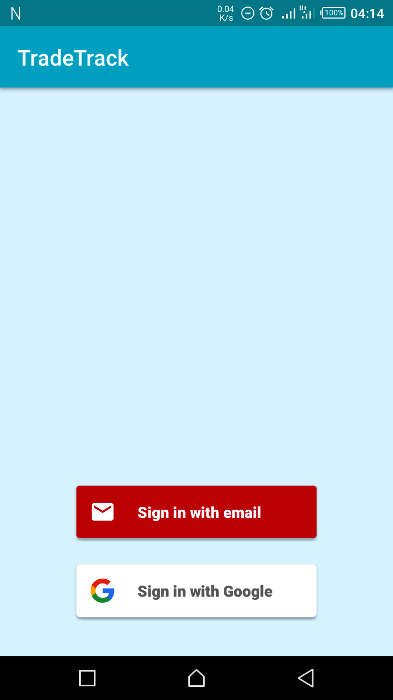
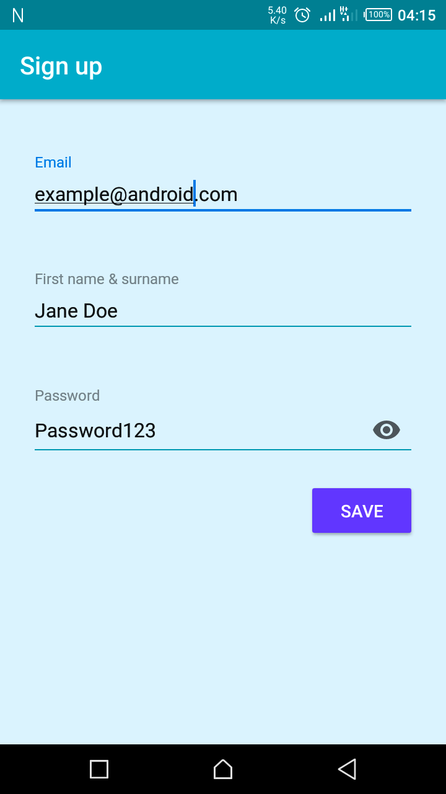
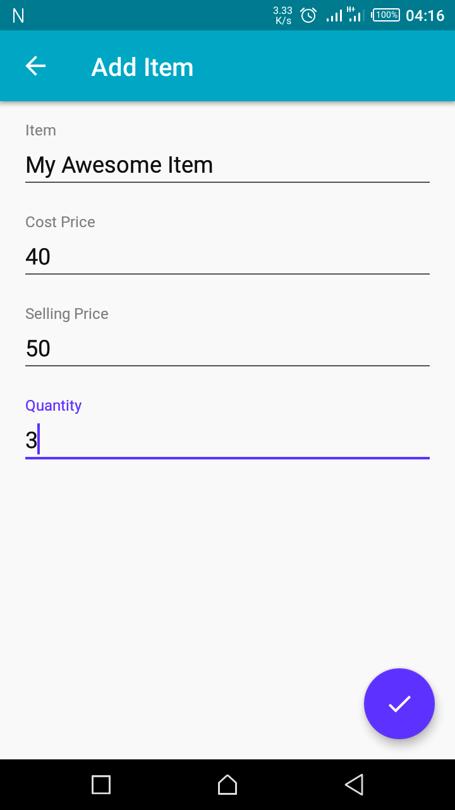
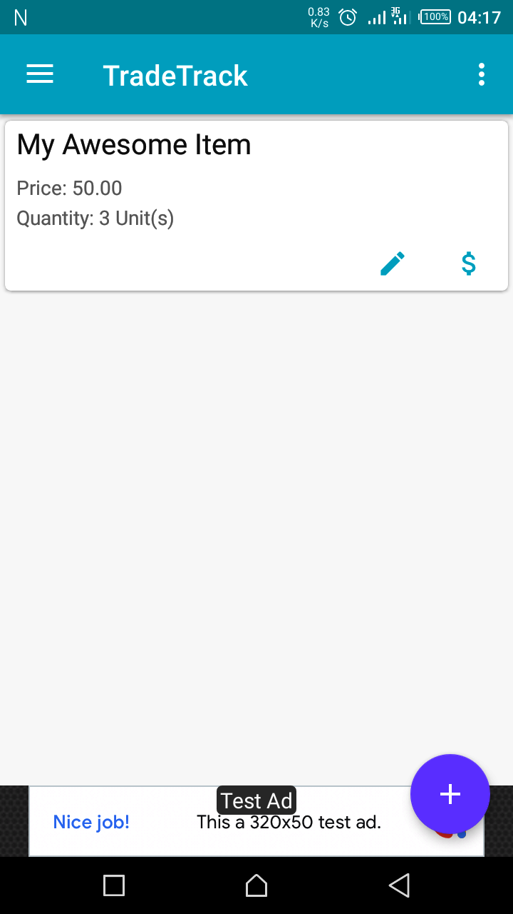

[](https://opensource.org/licenses/Apache-2.0)

# TradeTrack
TradeTrack was created as part of the Udacity Nanodegree Program. The app shows a detailed list of all items a user has in their shop and
the profit made daily.

## Features
* Add items to the inventory
* View items on the inventory
* View daily made profit
* Widget to show profit made in present day.
* Uses an IntentService to update widget.

## Screenshots






<br>

### Prerequisites
* JavaSE 7
* Android Studio 3.2.1 or later

### Installation
* Start up your terminal (or Command Prompt on Windows OS).
* Fork this repository or clone it using 
```
git clone https://github.com/Iyamu-J/TradeTrack.git
```
* Startup your Android Studio.
* In Android Studio, go to File -> New -> Import project.
* Navigate to the project directory and follow the instructions on the dialog wizard to import the project.
* Click [here](https://firebase.google.com/docs/android/setup) to add Firebase to the project.
* Once you are done and all is fully set, you can run the app.

## Libraries
*  [ButterKnife](http://jakewharton.github.io/butterknife/)
*  [joda-time](https://github.com/JodaOrg/joda-time)
*  [Firebase Crashlytics](https://firebase.google.com/docs/crashlytics/)
*  [Firebase Database](https://firebase.google.com/docs/database/)
*  [Firebase Auth](https://firebase.google.com/docs/auth/)
*  [Firebase Ads](https://firebase.google.com/docs/admob/)
*  [FirebaseUI Auth](https://github.com/firebase/FirebaseUI-Android/tree/master/auth)
*  [FirebaseUI Database](https://github.com/firebase/FirebaseUI-Android/tree/master/database)
